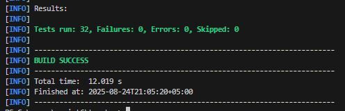
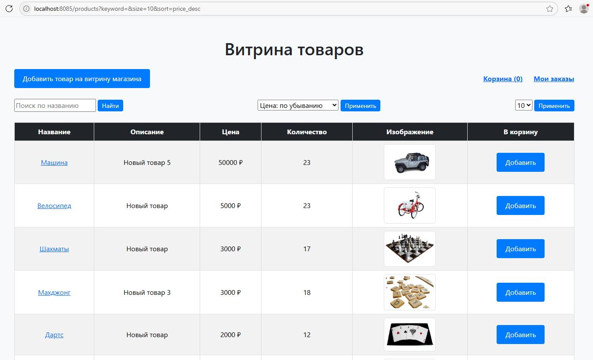
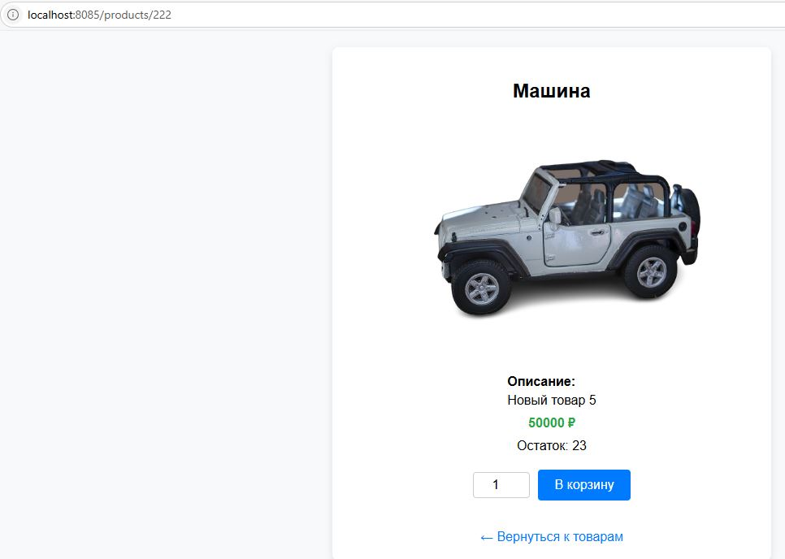
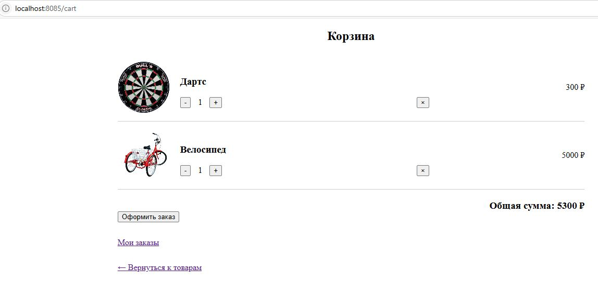
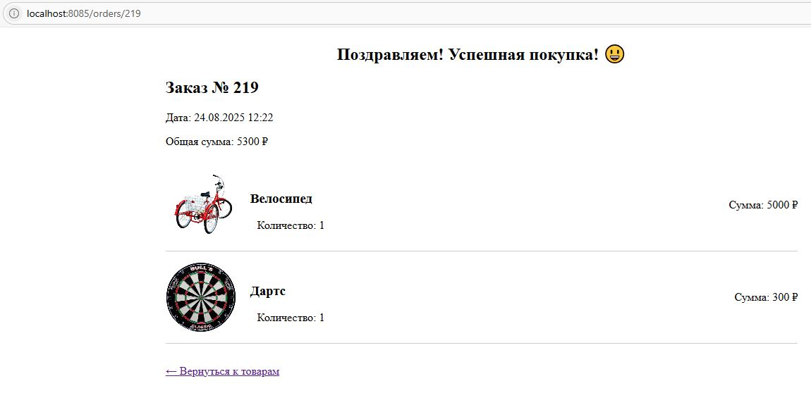
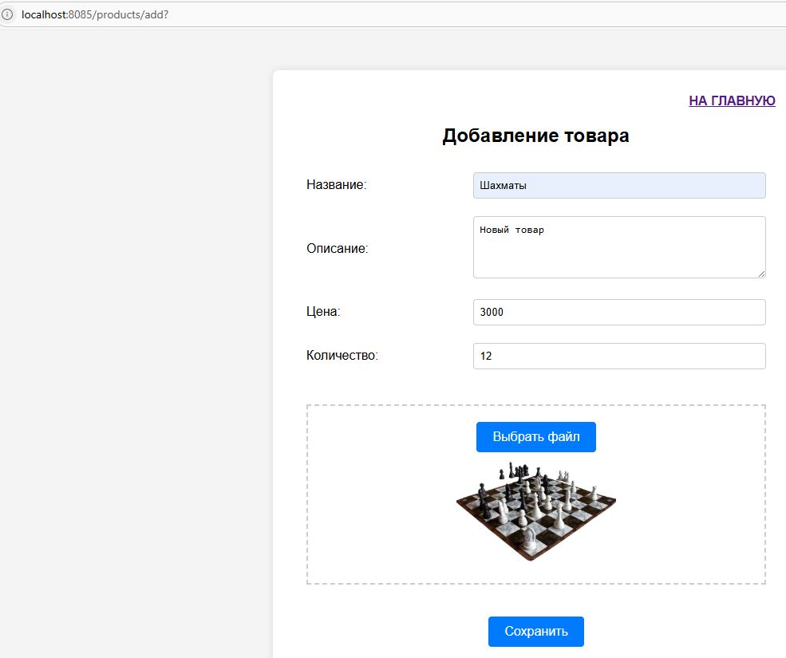

# Приложение "Витрина интернет-магазина" с использованием Spring Framework

## Требования и функциональность
* Веб-приложение "Витрина интернет-магазина", написанное на Spring Framework с использованием стартера (надстройки) - Spring Boot (версия 3.5.4 ). 
* Web UI приложения использует Spring WebFlux и подключается через соответствующий стартер.
* Приложение использует Spring Data R2DBC для доступа к данным в БД.
* База данных приложения - PostgreSQL с реактивным драйвером r2dbc-postgresql.
* Приложение упаковано в Executable JAR и запускается в Embedded Web Server (Netty).
* Разработана и осуществлена возможность запуска Executable JAR в Docker-контейнер с открытым веб-портом для доступа из браузера (8085) с использованием Docker и Docker Compose.
* Код приложения хранится в Git-репозитории (Github) по адресу: https://github.com/alex188w/toyshop-reactive.
* Образ контейнера Docker доступен по адресу: https://hub.docker.com/repository/docker/alex188w/toyshop_reactive.
* Сборка приложения осуществляется с помощью Maven (build system), которая управляет зависимостями и сборкой приложения.
* Код приложения написан на Java 21.
* Приложение покрыто тестами (юнит-, интеграционными) с использованием Spring Boot Test, Spring WebFlux и Spring Data R2DBC.

Веб-приложение представляет собой витрину товаров, которые пользователь может положить в корзину и купить.
* Приложение состоит из шести основных частей (модулей): страница витрины товаров, доступных для просмотра и покупки; страница товара; страница корзины покупателя; страница всех заказов; страница заказа; сервис покупки.

1. Страница витрины товаров — это веб-страница (html + javascript), на которой представлены:

- список товаров, доступных для заказа (картинка, название, цена, кнопка добавления в корзину/удаления из неё, кнопка изменения количества товара в корзине);

- список товаров может быть представлен в любом виде (списком, плиткой);
есть пагинация (по 10, 20, 50, 100 товаров);

- сверху строка поиска с фильтрацией по названию (можно просто по вхождению слова в название/описание товара);
сверху доступна фильтрация по цене, алфавиту.

2. При нажатии на товар происходит переход на веб-страницу карточки товара, на которой представлены:

- название, картинка, описание товара, возможность положить товар в корзину/удалить его, изменить количество в корзине;

- цена товара.

3. В правом верхнем углу любой веб-страницы есть кнопка перехода в корзину, которая представляет собой:
- веб-страницу со списком положенных в неё товаров, их количеством, ценой каждого товара и общей ценой всей корзины;
- есть возможность удалить товар из корзины, изменить его количество;
- есть кнопка оформления заказа.

На веб-странице корзины представлен список добавленных товаров (картинка, название, цена).
При нажатии на кнопку оформления заказа происходит эмуляция оформления заказа, при этом происходит переход на страницу оформленного заказа.

4. В правом верхнем углу любой веб-страницы есть кнопка перехода на страницу заказов, которая представляет собой:
- веб-страницу со списком всех оформленных заказов, суммой каждого заказа и общей суммой всех заказов;
- при нажатии на заказ появляется веб-страница совершённого заказа.

Дополнительно реализована страница добавления товара, на которой есть возможность добавить наименование товара, описание товара, его стоимость, количество и загрузить изображение.

Скриншоты основных страниц приложения приведены в конце описания.

## Краткое описание работы приложения

Приложение использует БД PostgreSQL. До запуска приложения в работу необходимо создать БД (напр. toyshop). 
    
Для корректной работы приложения в корне проекта нужно переименовать файл src\main\resources\application.templates.yml на application.yml и прописать в нем свои логин и пароль к БД PostgreSQL

    username: your_userName
    password: your_userPassword

Название БД прописано в строке (изменить при необходимости):

    url: r2dbc:postgresql://host.docker.internal:5432/db_name

Порт сервера приложения прописан в строке: SERVER_PORT=...

## Запуск приложения в работу

1. Сборка и запуск приложения из исходников локально на хостовой машине ОС Виндовс (БД должна быть запущена на хостовой машине) возможно командой: **mvn spring-boot:run**

При этом: 

    Собирается проект (компилирует Java-код, копирует ресурсы, прогоняет аннотации).

    Поднимается приложение прямо из исходников — без явного создания JAR.

    Подтягиваются зависимости на лету из локального Maven-репозитория (~/.m2/repository).

    Передаются в приложение все свойства (из application.yml).

    Проект остается в «живом» состоянии — пока не остановим процесс (Ctrl+C).

Приложение открывается по адресу: http://localhost:8085/products

Для корректной работе надо раскомментировать/закомментировать строки в файле .env следующим образом:

    # Если проект запускаем локально на хостовой машине
    DB_URL=jdbc:postgresql://localhost:5432/toyshop

    # Если проект запускаем в контейнере и обращаемся к БД на хостовой машине
    # DB_URL=jdbc:postgresql://host.docker.internal:5432/toyshop

2. Запуск Executable JAR в Docker-контейнер с открытым веб-портом для доступа из браузера (8085) с использованием Docker и Docker Compose.

В корне проекта должен быть создан файл - Dockerfile, в котором описываются инструкции для сборки образа Docker — шаги, которые скажут Docker, как подготовить среду для приложения.

Также в корне проекта должен быть создан файл docker-compose.yml, в котором описывается, как запускать контейнер — с его настройками, сетями, томами и переменными окружения. 
  
Docker и DockerCompose должны быть установлены и запущены на компьютере. Проверить можно командой:

    •	Версия Docker: docker --version
    •	Версия Docker Compose: docker compose version

Запуск приложения возможен одним из следующих вариантов:

    2.1. Скачать приложение из репозитория ДокерХаб командой: docker pull alex188w/toyshop_reactive:latest

    Переименовать файл: .env.templates в корне проека на .env, где прописать свои логин и пароль к БД PostgreSQL:

    DB_USER=your_user
    DB_PASSWORD=your_password

    Запустить с указанием файла .env командой: docker run --env-file .env -p 8085:8085 alex188w/toyshop_reactive:latest

    Приложение будет доступно в браузере по адресу: http://localhost:8085/products

    2.2. Чистим и собираем fat JAR из исходников командой: mvn clean package -DskipTests

    После этого в папке target/ появится файл toyshop.jar

    Затем нужно либо:
    
    2.2.1. Собрать образ вручную (если нужно)	docker build -t toyshop . и запустить командой: docker run --env-file .env -p 8085:8085 alex188w/toyshop_reactive:latest

    2.2.2. Запустить через Docker Compose командой:	docker compose up --build.

    После этого приложение будет доступно в браузере по адресу: http://localhost:8085/products

## Тестирование

Приложение покрыто модульными и интеграционными тестами с использованием Spring Boot Test, Spring WebFlux и Spring Data R2DBC и кеширования контекстов.

Интеграционное тестирвание выполняется в условиях, максимально приближенных к реальной среде выполнения приложения с использованием Testcontainers с PostgreSQL для Spring Boot.

Этот метод имеет следующие преимущества:

    Изоляция: тесты не зависят от локальной базы данных или внешних сервисов.

    Воспроизводимость: одна и та же конфигурация базы для всех тестов и разработчиков.

    Чистая база: можно легко сбрасывать состояние между тестами или перед каждым запуском.

    Быстрый старт/стоп: контейнер запускается и останавливается быстро.

    Контроллеры и сервисы подключаются к реальному слою данных через полноценный Spring-контекст.

Всего для покрытия Приложения тестами (юнит-, интеграционными) создано 32 теста.

Запуск всех тестов выполняется командой: mvn test

Запуск отдельно класса с тестами командой: mvn test -Dtest=TestClassName

Результаты тестирования:

## Скрины основных страниц приложения:

Главная страница прилоржения:

Страница товара:

Страница корзины:

Страница заказа:

Страница заказов:

Страница добавления товара:

